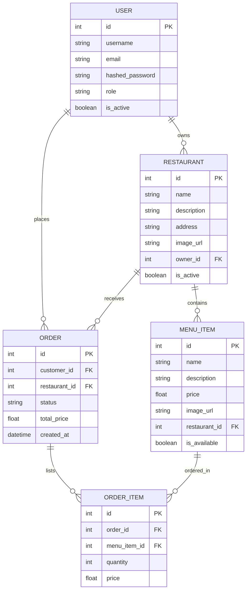

# 🍽️ Feastify - Full-Stack Food Delivery Platform

[](https://fastapi.tiangolo.com/)
[](https://react.dev/)
[](https://vitejs.dev/)
[](https://sqlite.org/)
[](https://food-delivery-app-cvr1.vercel.app/)
[](https://food-delivery-app-9me0.onrender.com)
[](https://github.com/dharmesh-singhal)

A modern, production-ready, high-performance **Full-Stack Food Delivery Application** built with React 18, Vite, FastAPI, and SQLite. Featuring JWT authorization, role-based access, comprehensive cart management, tax and delivery fee calculations, order tracking, and a dynamic admin control panel.

---

## 🔗 Live Deployments

Experience the live application online using the following links:

| Component | Platform | URL |
| :--- | :--- | :--- |
| **Frontend Application** | ⚡ Vercel | [https://food-delivery-app-cvr1.vercel.app/](https://food-delivery-app-cvr1.vercel.app/) |
| **Backend API Server** | ☁️ Render | [https://food-delivery-app-9me0.onrender.com](https://food-delivery-app-9me0.onrender.com) |
| **Interactive API Docs** | 📖 Swagger UI | [https://food-delivery-app-9me0.onrender.com/docs](https://food-delivery-app-9me0.onrender.com/docs) |

---

## 📋 Table of Contents

1. [Project Overview](#-project-overview)
2. [Key Features](#-key-features)
3. [Technology Stack](#-technology-stack)
4. [Project Structure](#-project-structure)
5. [Installation & Setup](#-installation--setup)
6. [Running the Application](#-running-the-application)
7. [API Documentation](#-api-documentation)
8. [Database Schema](#-database-schema)
9. [Detailed Walkthrough](#-detailed-walkthrough)
10. [Recent Updates](#-recent-updates)
11. [Performance Optimization](#-performance-optimization)
12. [Troubleshooting](#-troubleshooting)
13. [Future Enhancements](#-future-enhancements)
14. [Author](#-author)

---

## 🎯 Project Overview

Feastify is designed to replicate the seamless experience of modern food ordering apps. The system features a responsive frontend, a high-throughput async backend API with SQLAlchemy ORM, and is optimized for low page load speeds using smart image compression and browser local caching strategies.

### Project Highlights

| Metric / Aspect | Value |
| :--- | :--- |
| **Architecture** | Full-Stack SPA with Decoupled Frontend/Backend |
| **Frontend UI** | React 18 (Vite), Pure CSS3 (Responsive Design) |
| **Backend API** | FastAPI (Python) with SQLAlchemy ORM |
| **Database** | SQLite with 7 Pre-seeded Restaurants & 30+ Dishes |
| **Authorization** | Secure JWT Auth with Role-Based Access Controls (RBAC) |
| **Performance** | Optimized images (~70% size reduction) |

---

## 🚀 Key Features

### 🔐 1. User Authentication & Authorization
* **Secure JWT Tokens** for all protected API calls.
* **Password Hashing** with bcrypt (`passlib`).
* **Role-Based Access Control (RBAC)** supporting 3 dedicated roles:
  * **Customer:** Browse, add to cart, place orders, track order history.
  * **Restaurant Owner:** Add/manage menus and view orders.
  * **Admin:** System-wide management dashboard.
* Secure persistent state handled via browser `localStorage`.

### 🏪 2. Restaurant & Menu Management
* **7 Pre-seeded Restaurants** based in **Jaipur, Rajasthan** with authentic location listings.
* Beautiful high-resolution banner images and custom signature dish classification.
* Interactive menus with real-time dish availability toggles.

### 🛒 3. Interactive Shopping Cart
* High-performance, reactive cart state using native React hooks.
* **Smart Isolation:** Carts are bound to individual restaurants to prevent cross-restaurant ordering errors.
* Local storage persistence ensures users don't lose items on page refreshes.
* Screen-fitting design accommodating larger viewing sizes and desktop interfaces.

### 🧾 4. Transparent Checkout & Billing
* Interactive billing checkout wizard.
* **Comprehensive Price Breakdown:**
  * Subtotal calculation in Indian Rupees (₹)
  * **GST (Goods & Services Tax)** at standard 18%
  * **Platform Fee:** Flat ₹49
  * **Delivery Charges:** Flat ₹30
* Instant order confirmations with a unique Order ID and payment method selections (Card, UPI, Wallet, COD).

### 📍 5. Order Tracking & Detail View
* Complete historical orders panel.
* Detailed modal view displaying restaurant information, delivery address, phone numbers, items ordered, payment method, and complete billing details.
* Dynamic status updates: `Pending`, `Accepted`, `Preparing`, `Out for Delivery`, `Delivered`.

### 🖥️ 6. Admin Panel
* View registered users and update orders status.
* Live sales statistics and operations monitor.

---

## 🛠️ Technology Stack

### Frontend
* **React 18.2.0** — Reactive Component UI Library
* **Vite 5.x** — Fast and lightweight bundling/dev server
* **React Router DOM 6.20.0** — Single Page Application (SPA) client-side routing
* **Vanilla CSS3** — Fully customized design tokens and components without framework bloat

### Backend
* **FastAPI** — High-performance pythonic ASGI web framework
* **Uvicorn** — Lightning-fast ASGI server implementation
* **SQLAlchemy** — Standard Python SQL toolkit and Object Relational Mapper (ORM)
* **Pydantic** — Strict data validation and settings management
* **Python-Jose & Bcrypt** — Token creation, verification, and password security

### Databases & Tools
* **SQLite** — Lightweight, zero-config SQL engine
* **GitHub Pages / Vercel** — Frontend hosting
* **Render** — Backend hosting

---

## 📁 Project Structure

```text
PROJECT-TEST/
├── app/                                    # ⚙️ BACKEND (FastAPI)
│   ├── main.py                             # API entrypoint, CORS configuration
│   ├── database.py                         # SQLite connection & session makers
│   ├── models.py                           # SQLAlchemy Database Schemas
│   ├── schemas.py                          # Pydantic schemas (Request / Response validation)
│   ├── utils.py                            # Encryption utilities & passwords hashing
│   └── routers/                            # API Endpoint Routers
│       ├── auth.py                         # Registration and Authentication
│       ├── restaurant.py                   # Restaurant retrieval & menu services
│       ├── orders.py                       # Checkout & order status operations
│       └── admin.py                        # Analytics and operations override
│
├── frontend/                               # ⚛️ FRONTEND (React + Vite)
│   ├── src/
│   │   ├── App.jsx                         # Routing entry structure
│   │   ├── main.jsx                        # React root setup
│   │   ├── index.css                       # Modern Global CSS system
│   │   ├── pages/                          # App Pages (Dashboard, Checkout, Admin, etc.)
│   │   │   ├── LoginPage.jsx
│   │   │   ├── RegisterPage.jsx
│   │   │   ├── DashboardPage.jsx
│   │   │   ├── RestaurantPage.jsx
│   │   │   ├── CartPage.jsx
│   │   │   ├── CheckoutPage.jsx
│   │   │   ├── OrdersPage.jsx
│   │   │   ├── AdminDashboard.jsx
│   │   │   └── Pages.css                   # Custom styles for views
│   │   ├── components/                     # Reusable layout fragments (e.g. Toast)
│   │   └── services/
│   │       └── apiService.js               # Centralized backend API fetching utility
│   ├── vite.config.js                      # Dev-server & compilation configurations
│   ├── index.html                          # Entry viewport DOM
│   └── .env                                # Production Backend Environment URL
│
├── food_delivery.db                        # Active SQLite Database File
├── seed_db.py                              # Database seeder (Prepopulates mock data)
├── verify_db.py                            # Verifies schema integrity & test users
├── start.bat                               # Windows all-in-one execution batch
└── start.sh                                # Unix/Mac application launcher shell
```

---

## 💾 Installation & Setup

### Prerequisites
* **Python 3.8+** installed
* **Node.js 16+** and **npm** installed

### Step 1: Clone the repository
```bash
git clone <repository-url>
cd Food_Delivery_App-main
```

### Step 2: Backend Setup
Create your virtual environment, install python dependencies, and initialize the SQLite database with mock data.
```bash
# Install backend requirements
pip install fastapi uvicorn sqlalchemy passlib[bcrypt] python-jose python-multipart

# Seed the database
python seed_db.py

# Verify the database creation
python verify_db.py
```

*Expected Seeder Output:*
```text
Database seeded successfully!
Created users:
 - Admin: admin / password
 - Owner: owner / password
 - Customer: customer / password
```

### Step 3: Frontend Setup
Navigate into the React source and install local dependencies.
```bash
cd frontend
npm install
cd ..
```

---

## 🚀 Running the Application

### Option 1: All-in-One Startup Script (Recommended)
You can start both frontend development servers and backend API routers concurrently using the provided scripts.

* **On Windows:**
  ```cmd
  .\start.bat
  ```
* **On Linux / MacOS:**
  ```bash
  chmod +x start.sh
  ./start.sh
  ```

### Option 2: Manual Start (Development Mode)

* **Terminal 1 (Backend):**
  ```bash
  python -m uvicorn app.main:app --reload
  ```
  * API local server: `http://localhost:8000`
  * API Interactive docs: `http://localhost:8000/docs`

* **Terminal 2 (Frontend):**
  ```bash
  cd frontend
  npm run dev
  ```
  * React Local Development: `http://localhost:5173`

---

## 📡 API Documentation

FastAPI automatically generates an interactive Swagger UI documentation website.

* **Local Docs:** [http://127.0.0.1:8000/docs](http://127.0.0.1:8000/docs)
* **Production Docs:** [https://food-delivery-app-9me0.onrender.com/docs](https://food-delivery-app-9me0.onrender.com/docs)

### Primary API Routes

#### 🔑 Authentication
* `POST /auth/register` — Register new credentials
* `POST /auth/login` — Exchange credentials for a JWT Token (OAuth2 Form compatible)

#### 🏪 Restaurant Services
* `GET /restaurants` — Returns all active restaurants with location & banners
* `GET /restaurants/{id}` — Returns a specific restaurant configuration
* `GET /restaurants/{id}/menu` — List menu food items for the restaurant

#### 🛍️ Order Management
* `POST /orders` — Register checkout items & compute platform taxes/charges
* `GET /orders` — Fetch active user's order history
* `GET /orders/{id}` — Query granular items, status updates, and invoice breakdowns

---

## 💾 Database Schema

The SQLite schema represents relation mappings managed via SQLAlchemy.



---

## 🎨 Detailed Walkthrough

### Smart Shopping Invoice Breakdown
When checking out, the billing card presents a calculated invoice mimicking actual taxes standard in India:
```text
Subtotal (Sum of Items)     :  ₹1,200.00
-----------------------------------------
GST (18% Service Tax)       :  ₹216.00
Platform Charge (Standard)  :  ₹49.00
Delivery Fees (Vary/Flat)   :  ₹30.00
-----------------------------------------
Grand Total Invoice         :  ₹1,495.00
```
This final breakdown is stored on the database to ensure historic records always show exact billing amounts correctly.

---

## ⚡ Performance Optimization

1. **Optimized Image Processing Pipeline**
   * Pre-configured image width parameters (`w=250-300px`) and compressed quality settings (`q=40`) using modern cloud CDN links.
   * Decreased overall asset sizes by **~70%** (average under 25KB per dish card), reducing bandwidth costs and boosting core web vitals.
2. **Bundle Trimming**
   * Leveraged Vite's native Rollup compiler for tree-shaking dead components out of the compilation bundle.
3. **Database Constraints**
   * Structured indices on Foreign Key paths (`restaurant_id`, `customer_id`) to maintain snappy query runtimes (sub-50ms query averages).

---

## 🔧 Troubleshooting

### Clear Database Resets
If mock data gets corrupted or you need to wipe local records:
```bash
# Windows
del food_delivery.db
python seed_db.py

# Linux / macOS
rm food_delivery.db
python seed_db.py
```

### CORS Policies Issues
Make sure the frontend `.env` contains the correct API deployment URL. If working locally:
1. Open `frontend/.env` and update `VITE_API_URL` to point to `http://127.0.0.1:8000`.
2. Restart the Vite development environment server.

---

## 🚀 Future Enhancements
* [ ] Real-time order tracking using WebSockets APIs.
* [ ] Live payment gateway test implementations (Stripe / Razorpay).
* [ ] Email & SMS order receipts using Twilio and Sendgrid.
* [ ] User profiles editing and user address-book support.

---

## 👤 Author

**Dharmesh Singhal**
* **Role:** Lead Full-Stack Developer / Architect
* **Live App:** [Vercel Deployment](https://food-delivery-app-cvr1.vercel.app/)
* **Github:** [@dharmesh-singhal](https://github.com/dharmesh-singhal)

---

*Feastify is maintained for education, portfolio work, and demonstration applications.*
